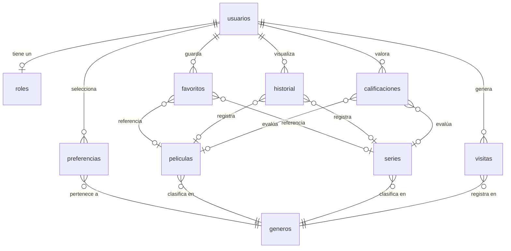
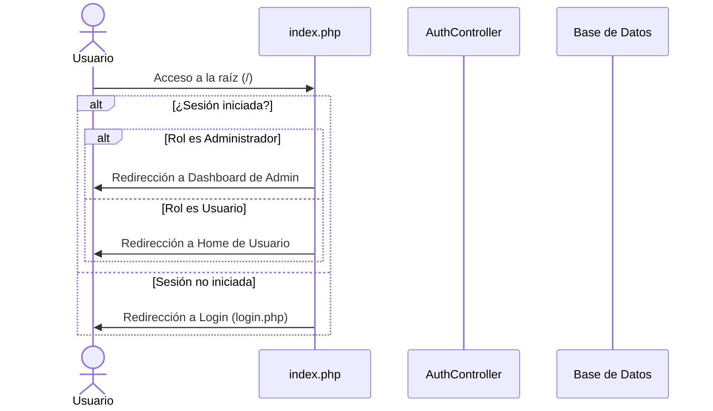

# Documento de Funcionamiento y Flujo del Sitio Web

Este documento proporciona una descripción detallada del funcionamiento, la arquitectura, el modelo de datos y los flujos de navegación del **Proyecto Final**, una plataforma web de streaming y recomendación de películas y series de televisión.

---

## 1. Arquitectura General del Sistema

El sitio web está desarrollado en **PHP** bajo un patrón de diseño **MVC (Modelo-Vista-Controlador)** desacoplado, utilizando bases de datos relacionales (**MySQL**) y servicios de frontend basados en **Vanilla Javascript** y **CSS personalizado**.

### Estructura de Directorios Principal
*   [`/config/`](file:///c:/xampp/htdocs/ProyectoFinal/config/): Contiene configuraciones globales del sistema (`config.php`) y la conexión a base de datos (`database.php`).
*   [`/controllers/`](file:///c:/xampp/htdocs/ProyectoFinal/controllers/): Controladores que manejan la lógica de negocio (`AuthController`, `MovieController`, `SeriesController`, `StatsController`).
*   [`/models/`](file:///c:/xampp/htdocs/ProyectoFinal/models/): Clases del modelo que interactúan directamente con la base de datos a través de consultas seguras (`User`, `Movie`, `Series`, `Favorite`, `History`, `Preference`, `Genre`).
*   [`/views/`](file:///c:/xampp/htdocs/ProyectoFinal/views/): Archivos de interfaz de usuario distribuidos por roles e inicializadores (`auth`, `admin`, `usuario`, `includes`).
*   [`/services/`](file:///c:/xampp/htdocs/ProyectoFinal/services/): Servicios web en formato **JSON** (`api.php`) para interactividad asíncrona y **XML** (`catalog.php`) para importaciones y exportaciones.
*   [`/assets/`](file:///c:/xampp/htdocs/ProyectoFinal/assets/): Recursos estáticos (estilos CSS, imágenes de portadas y avatars, y scripts JS).

---

## 2. Modelo de Datos y Base de Datos

El diseño de la base de datos en MySQL consta de 10 tablas principales estructuradas para el almacenamiento seguro y la recopilación de datos analíticos:

### Descripción de Tablas Clave
1.  **`roles`**: Almacena los perfiles de usuario permitidos (`Administrador`, `Usuario`).
2.  **`usuarios`**: Datos de acceso (con contraseñas encriptadas mediante `password_hash`).
3.  **`generos`**: Categorías de contenido (Acción, Terror, Comedia, etc.).
4.  **`preferencias`**: Relación de géneros favoritos seleccionados por el usuario durante su registro.
5.  **`peliculas` / `series`**: Almacenan el catálogo físico del contenido. Incluyen metadatos como descripción, año, duración (o temporadas/episodios), URLs de portadas y videos (YouTube embebido), e indicadores de clics.
6.  **`favoritos`**: Guarda la lista personalizada del usuario ("Mi Lista").
7.  **`historial`**: Realiza el seguimiento del progreso de visualización (porcentaje del 0 al 100%).
8.  **`calificaciones`**: Evaluaciones de 1 a 5 estrellas con comentarios escritos.
9.  **`visitas`**: Registro histórico de accesos por categoría/género para alimentar el motor de estadísticas.

---

## 3. Flujo y Funcionamiento de Autenticación

El enrutador principal en `index.php` actúa como puerta de enlace y distribuye a los usuarios según su estado de sesión actual:

### Procesos de Autenticación

#### Inicio de Sesión (Login)
*   **Identificación Doble**: Permite autenticación mediante el nombre de usuario (`username`) o el correo electrónico (`email`).
*   **Seguridad contra Fuerza Bruta**: Si el usuario falla la contraseña 3 veces consecutivas, el sistema registra este estado en la sesión y bloquea nuevos intentos durante **30 segundos** (`$_SESSION['login_block_until']`).
*   **Recordar Usuario**: Si se marca la casilla "Recordar", guarda el nombre de usuario en una cookie segura (`remember_user`) por 30 días para pre-cargar el campo en futuras visitas.

#### Registro de Cuenta (Register)
*   **Validaciones del Servidor**: Controla que el nombre de usuario/correo no estén repetidos, confirma las contraseñas y exige un largo mínimo de 6 caracteres.
*   **Preferencias Temáticas**: Muestra casillas de verificación para seleccionar géneros de interés. Estas preferencias se guardan en la tabla `preferencias` y definen directamente las recomendaciones personalizadas posteriores.
*   **Auto-login**: Al registrarse con éxito, inicia la sesión inmediatamente, configura el tema por defecto en oscuro y redirige al Home.

---

## 4. Flujo de Navegación del Usuario

Una vez autenticado como **Usuario**, este accede a una interfaz multimedia moderna optimizada para interacciones asíncronas vía AJAX:

### 1. Página de Inicio (`home.php`)
Presenta un diseño estructurado por filas dinámicas y banners:
*   **Banner Destacado (Hero)**: Selecciona de forma automática un contenido sugerido por el motor de recomendaciones. Ofrece accesos directos rápidos para **reproducir** o **añadir a lista de favoritos** directamente.
*   **Carruseles Horizontales (Soportan Arrastre con Mouse)**:
    *   **Continuar Viendo**: Muestra contenidos iniciados pero no terminados, indicando el porcentaje exacto de progreso en una barra visual.
    *   **Recomendados**: Títulos personalizados según los géneros seleccionados en el registro del usuario.
    *   **Populares**: Mapea los títulos con mayor cantidad de visitas físicas (clics).
    *   **Nuevos Lanzamientos**: Ordena el catálogo de forma descendente por año de estreno.
    *   **Categorías Específicas**: Divisiones de géneros populares (Acción, Terror, Comedia, Drama).

### 2. Buscador en Tiempo Real
El buscador superior situado en la barra de navegación (`navbar.php`) realiza consultas en vivo. Al ingresar 2 o más caracteres, activa un script JS (`app.js`) que:
1.  Llama asíncronamente al endpoint de la API: `services/json/api.php?action=search&q={término}`.
2.  Genera una lista interactiva emergente con imágenes, títulos, tipo (Película/Serie) y año.
3.  Permite la redirección inmediata a la vista de detalles al hacer clic.

### 3. Ficha de Detalle y Reproductor Simulador (`detail.php`)
Cuando un usuario hace clic en una película o serie:
*   **Registro Analítico**: El sistema incrementa en 1 los clics del contenido en su base de datos e inserta una visita al género (`visitas`) para retroalimentar el sistema de estadísticas del administrador.
*   **Reproducción e Historial en Vivo (AJAX)**:
    *   Al pulsar "Ver Ahora", se despliega un modal superpuesto que carga un trailer en un iframe de YouTube.
    *   **Simulador de Progreso**: Mientras el modal se mantiene abierto, un intervalo en JavaScript simula la visualización enviando solicitudes HTTP POST a `services/json/api.php?action=update_history` cada **3 segundos**, incrementando el progreso en un **5%**.
    *   Si el usuario cierra el reproductor antes del 100%, la página se recarga para mostrar el contenido actualizado en la sección "Continuar viendo" de la página de inicio.
*   **Calificaciones y Reseñas**:
    *   El usuario puede enviar una puntuación de 1 a 5 estrellas acompañada de un comentario de texto.
    *   Si el usuario ya había calificado el contenido, el sistema actualiza su reseña original en lugar de duplicarla.
    *   Calcula de forma dinámica la calificación promedio del contenido.

### 4. Mi Lista (`favorites.php`) y Recomendaciones (`recommendations.php`)
*   **Favoritos**: Lista estática de los contenidos añadidos por el usuario. El botón de favoritos responde instantáneamente sin recargar la página gracias a consultas AJAX a la API (`action=toggle_favorite`).
*   **Recomendaciones**: Despliega el catálogo completo recomendado para el usuario basándose en sus preferencias y visitas anteriores.

---

## 5. Flujo de Navegación del Administrador

Los usuarios autenticados con rol de **Administrador** son los únicos que pueden acceder a la carpeta `/views/admin/` a través de un control estricto de seguridad (`requireRole('Administrador')`).

### 1. Panel de Control / Dashboard (`dashboard.php`)
El panel administrativo ofrece una vista global de la plataforma:
*   **Tarjetas de Resumen**: Muestran el número total de usuarios registrados, películas, series y géneros.
*   **Gráficos Estadísticos Dinámicos (HTML/CSS)**:
    *   *Géneros más visitados*: Gráfico de barras horizontales basado en los datos almacenados de la tabla `visitas`.
    *   *Títulos más populares*: Gráfico de barras horizontales que mide el volumen acumulado de clics.
*   **Actividad Reciente**: Tabla que lista cronológicamente el historial de visualización de los usuarios, detallando su progreso y fecha de acceso.

### 2. Gestión de Contenido (CRUDs de Administración)
*   **Películas (`movies.php`) y Series (`series.php`)**:
    *   **Creación y Actualización**: Formularios que permiten añadir o modificar títulos, descripciones, años de lanzamiento, duraciones, número de temporadas/episodios y enlaces de video.
    *   **Carga de Archivos**: Los administradores pueden subir imágenes directamente desde su computadora, las cuales son procesadas, renombradas y almacenadas en el directorio `/uploads/`, actualizando automáticamente su ruta en la base de datos.
    *   **Eliminación**: Remueve de forma definitiva el registro de la base de datos (con protección de claves foráneas mediante cascada en favoritos, historial y calificaciones).
*   **Géneros (`genres.php`)**: Permite añadir nuevos géneros temáticos o editar la ortografía de los existentes.
*   **Usuarios (`users.php`)**: Permite ver a los usuarios registrados en el sistema.

---

## 6. Canales de Servicios Web y APIs

La plataforma implementa dos tecnologías de integración de datos en la carpeta `/services/`:

### 1. API JSON (`services/json/api.php`)
Proporciona endpoints que soportan la interacción asíncrona de la aplicación cliente (JS):
*   `GET ?action=get_movies&q=...&genre_id=...`: Devuelve una lista de películas filtrada.
*   `GET ?action=recommendations&limit=...`: Proporciona recomendaciones basadas en preferencias del usuario logueado.
*   `POST ?action=toggle_favorite`: (Requiere autenticación) Agrega o elimina un contenido de la lista del usuario.
*   `POST ?action=update_history`: (Requiere autenticación) Actualiza el porcentaje del historial de reproducción del usuario sobre un contenido específico.
*   `GET ?action=search&q=...`: Retorna coincidencias de búsqueda mezcladas (películas y series).

### 2. WebService XML (`services/xml/catalog.php`)
Diseñado para la portabilidad e intercambio del catálogo completo de películas y series:
*   **Exportación (Método GET)**: Genera dinámicamente un documento XML bien estructurado (`<catalog>`) con todas las películas (`<movie>`) y series (`<serie>`) registradas en el sistema, detallando sus atributos y nombres de género.
*   **Importación (Método POST)**:
    *   Solo ejecutable por usuarios autenticados con rol de **Administrador**.
    *   Recibe un payload XML en el cuerpo de la petición.
    *   **Validación de Datos**: Analiza la validez del archivo XML y devuelve códigos de error detallados si el formato es inválido.
    *   **Inserción Dinámica**: Lee los géneros de los títulos provistos; si un género no se encuentra registrado en el sistema local, lo crea de forma automática en la tabla `generos` y asocia el contenido importado al nuevo ID generado.
